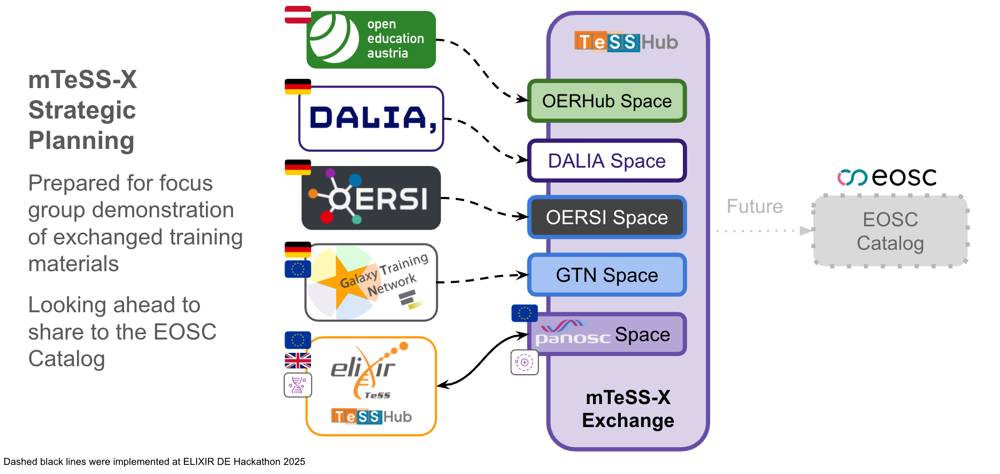
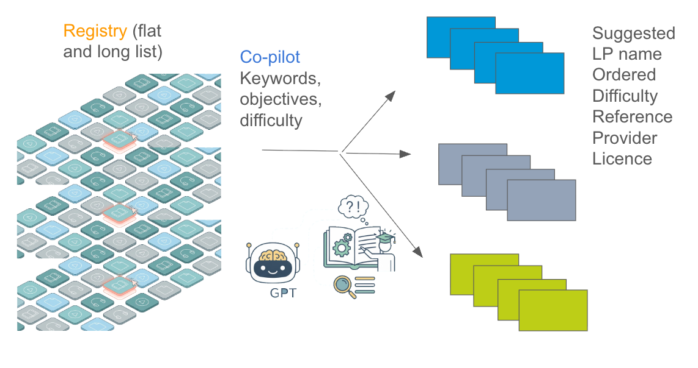
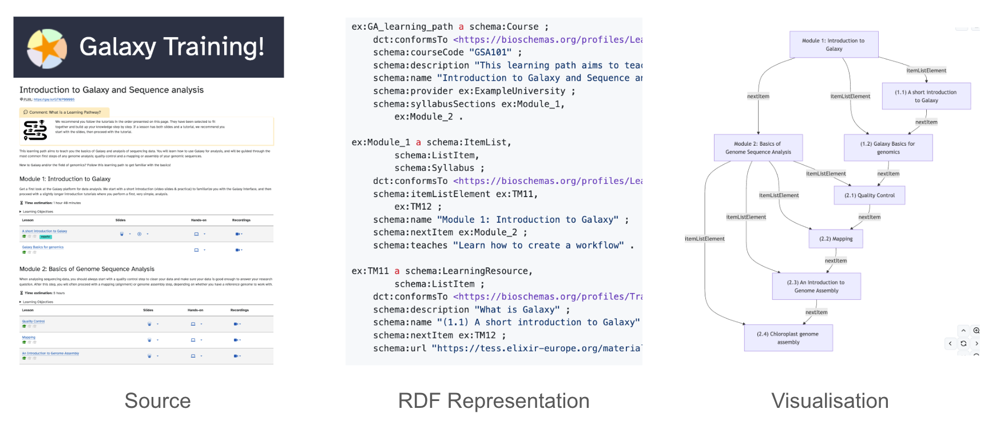
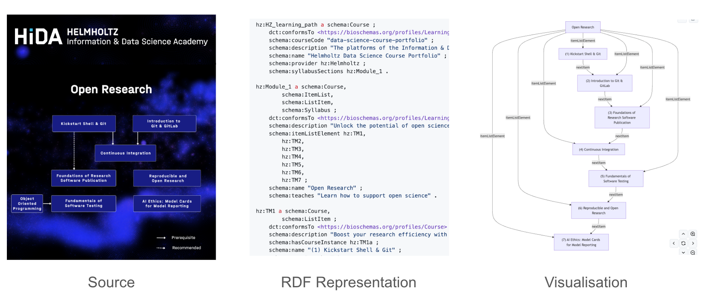
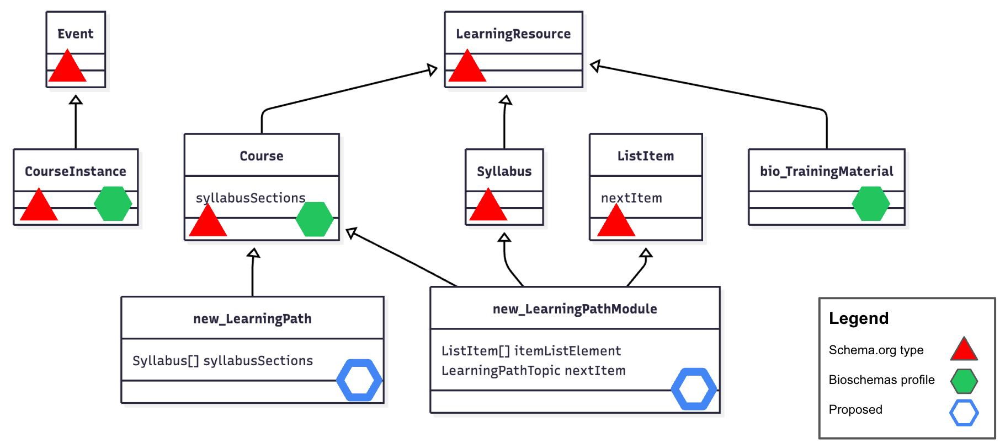
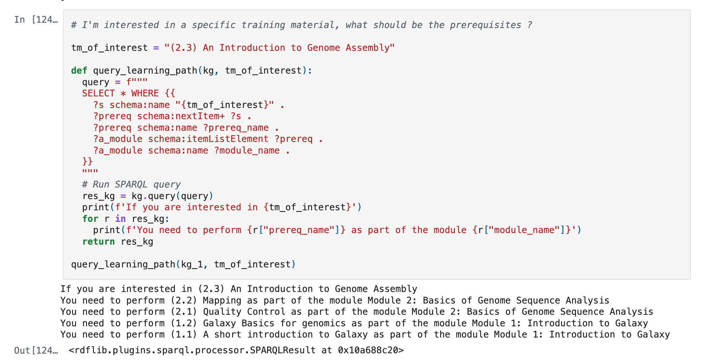

# Abstract

The fragmentation of training materials across research infrastructures often results in unsustainable resource duplication and significant barriers to upskilling. This work aims to enable developers to build systems that effectively discover relevant materials by promoting a federated, **FAIR-compliant strategy** for open training. The project operated across three interrelated streams: metadata **interoperability**, material **analysis**, and the definition and representation of **learning paths in a machine readable manner**.

We demonstrated content **federation** via the **mTeSS-X** platform, enabling cross-instance exchange and preparing for future integration with the EOSC federation. To enhance interoperability, we indexed relevant ontologies and curated semantic **crosswalks** between established metadata models, specifically **MoDALIA** and **Schema.org/Bioschemas**. These mappings were implemented within the open-source **OERbservatory** Python package, providing a facility for exchanging data between platforms such as DALIA and TeSS. For material analysis, we utilised **Large Language Models (LLMs)** and vectorisation techniques to calculate similarity, allowing for the identification of related materials and the deduplication of records across registries.

To address the lack of machine-actionable trajectories, we proposed **new Bioschemas profiles** specifically for **learning paths**. By extending Schema.org types, including Course and Syllabus, we developed a schema that supports modular and linear orderings of training materials. This model was validated using SPARQL queries on knowledge graphs derived from real-world examples like the Galaxy Training Network. Such advancements provide a foundation for automated path generation and improved discoverability within training catalogues.

# Introduction

**Overall aim: Enable developers to build systems that support learners to find relevant training materials.**

The distributed and fragmented nature of training materials across research infrastructures, institutions, and within project silos often leads to duplication of materials, wasted resources and storage, the inefficient use of those materials in upskilling personnel, and contributes to the lack of sustainability of the materials themselves. This situation is further exacerbated when considering cross-disciplinary or domain-agnostic materials, such as those for Research Data Management, which are equally applicable or could be used across multiple domains. Furthermore, several metadata standards including [Schema.org](http://Schema.org), [Bioschemas](https://bioschemas.org/), [schemas.science](https://schemas.science/), [PaNET](https://github.com/ExPaNDS-eu/ExPaNDS-experimental-techniques-ontology) and [MoDALIA](https://dalia.pages.rwth-aachen.de/dalia-ontology/) are used by different training catalogues, making the identification of equivalent materials in different repositories more difficult. These search engine-based learning object metadata models enjoy a widespread adoption, although education-based data models are also available [@citesForInformation:Sonnati2024]. 

One way to address these challenges would be to offer a federated solution, connecting across those project or institutional communities/silos, and promoting a cohesive strategy towards FAIR and open training. The [OSCARS mTeSS-X project](https://elixirtess.github.io/mTeSS-X/) strives to support this approach by using multi-tenancy and enabling cross-instance content exchange, for registries based on the TeSS Platform [@citesForInformation:Reed2025]. The mTeSS-X project would additionally facilitate the identification of learning paths or trajectories to enable individuals to leverage content across multiple ‘siloed’ materials, to achieve knowledge goals. Significant progress has been made by the [ELIXIR Learning Paths Focus Group](https://elixir-europe.org/focus-groups/learning-paths) to develop a learning paths protocol to guide learners to progressively acquire knowledge and skills on a subject of interest [@citesForInformation:Cardona2022]. Examples of learning paths developed by this protocol will launch throughout 2026.Additionally, ‘alternative’ paths could be offered across the problem space, which would be exposed, recognised and attributed, thereby identifying the original contributors. Many existing learning paths are linear and sequential, lacking legitimate and viable alternative trajectories.

In this project, we worked in three parallel, interrelated streams:

1. Training material interoperability  
   * Identifying and indexing relevant ontologies, controlled vocabularies, and schemas for learning materials and (open) educational resources.  
   * Curating mappings between ontologies and controlled vocabularies terms and crosswalks between schemas. Specifically, we focused on curating crosswalks between the representations of learning materials in the schemas from MoDALIA and Schema.org/Bioschemas.  
   * Implementing mappings in the OERbservatory Python package.  
   * Proposals for a demonstration of federation in the mTeSS-X platform.  
2. Training material analysis  
   * Identifying similar training materials using LLMs and prompt engineering.  
   * Deduplicating and merging records across registries.  
   * Connecting training material producers at institutional and individual level, consolidating efforts.  
3. Organisation into learning paths  
  * Collecting examples of learning paths to identify schema requirements  
  * Developing a model based on requirements that enables grouping of learning materials into a logical and modular ordering  
  * Mocking up/proposing a schema extending Schema.org/Bioschemas

The first day of the project began with a [series of short presentations](https://docs.google.com/document/d/1KpRX1Q777Fzz8dcAx1jgiipiH6Zyir33_ds0xPK7M50/edit?usp=sharing) from several of the authors, plus a demonstration of ELIXIR BioHackathon Europe work titled ‘Mining the potential of knowledge graphs for metadata on training’ by Dimitris Panouris and Harshita Gupta of SciLifeLab. [@citesForInformation:Panouris2025]

# Training material interoperability; express relations between materials

Authors: Charles Tapley Hoyt, Oliver Knodel, Martin Voigt, Jacobo Miranda, Petra Steiner 

Contributors: Phil Reed, Leyla Jael Castro 

## Interoperability through semantic mapping and crosswalks

Interoperability is the third pillar of the [FAIR data principles](https://www.nature.com/articles/sdata201618). Metadata describing training materials may be captured and stored in one of several data models including the DALIA Interchange Format (DIF) v1.3, the format implicitly defined by the TeSS API, and the Schema.org [LearningResource](https://schema.org/LearningResource) type. Further, metadata records conforming to these data models are filled with references to terms in other ontologies, controlled vocabularies, databases, and other resources that mint (persistent) identifiers. Our overarching goal at the hackathon was to improve interoperability on both levels.

The Semantic Farm ([https://semantic.farm](https://semantic.farm/)) is a database of metadata about resources that mint (persistent) identifiers (such as ontologies, controlled vocabularies, databases, schemas). It imports and aligns with other databases like [Identifiers.org](https://identifiers.org/) (for the life sciences) and [BARTOC](https://bartoc.org/) (for the digital humanities) to support interoperability and sustainability. The hackathon team produced [additional entries to the Semantic Farm](https://semantic.farm/collection/0000018) to better support the mapping and discovery of cross-disciplinary training materials, details of which can be found on the Biopragmatics blog [@citesForInformation:TapleyHoyt2025].

Curating correspondences between concepts in ontologies, controlled vocabularies, and databases is often called semantic mapping. In contrast, curating correspondences between schemas and the properties therein is often called crosswalks. We put an emphasis on producing crosswalks between Schema.org and MoDALIA. This is a complex problem due to the fact that correspondences between elements in schemas can be more sophisticated (for example, mapping between two fields for first and last names to a single name field).

### Implementation of mappings and interchange

The OERbservatory Data Model was proposed as an interoperability hub between DALIA and TeSS. During the hackathon, we implemented the open source [OERbservatory](https://doi.org/10.5281/zenodo.18346546) Python package. It includes three major features:

1. a unified, generic [object model](https://github.com/data-literacy-alliance/oerbservatory/blob/main/src/oerbservatory/model.py) for open educational resources that’s effectively the union of the best parts of DALIA, TeSS, Schema.org, and a few other data models we found  
2. import and export to two open educational resource and learning materials data models - DALIA and TeSS. We didn’t have time during the hackathon to implement import and export to Schema.org.  
3. import from three external learning material repositories - [OERhub](https://oerhub.at/), [OERSI](https://oersi.org/), and the [Galaxy Training Network (GTN)](https://training.galaxyproject.org/).

[Further](https://training.galaxyproject.org/) details of OERbservatory can be found on the Biopragmatics blog [@citesForInformation:TapleyHoyt2025].

### Preparing for EOSC federation

Proposals for a demonstration of federation in the mTeSS-X platform.

The next step towards interoperability beyond the conversion between formats used by DALIA and TeSS was to demonstrate actually posting the content to the live services.

While we are currently in the process of implementing submission of open educational resources and learning materials in DALIA, TeSS already has a web-based interface for registering new learning materials. We implemented posting learning materials in the TeSS-specific Python package in [cthoyt/tess-downloader\#2](https://github.com/cthoyt/tess-downloader/pull/2). Then, it was only a matter of stringing together code that converts DALIA to OERbservatory, OERbservatory to TeSS, and then to upload to TeSS.

In parallel, we worked on improving the devops behind the [PaNOSC TeSSHub](https://tesshub.hzdr.de/) to enable quickly spinning up new TeSS instances that each have their own subdomain. We created a different subdomain for each of DALIA, OERSI, GTN/KCD, and OERhub. Finally, we wrote a script that uploaded all open educational resources and learning material from each source to the appropriate TeSS instance in [data-literacy-alliance/oerbservatory\#3](https://github.com/data-literacy-alliance/oerbservatory/pull/3). The results in each space can be explored here:

|Source	|Domain|  
|---|---|  
|DALIA	|https://dalia.tesshub.hzdr.de|  
|OERhub	|https://oerhub.tesshub.hzdr.de|  
|OERSI	|https://oersi.tesshub.hzdr.de|  
|GTN/deKCD	|https://kcd.tesshub.hzdr.de|  
|PanOSC	|https://panosc.tesshub.hzdr.de|

## Future work

* Continue to demonstrate exchange of training material between registries using TeSS.  
* New deployment of DALIA implementing interoperability layer.

# Training material analysis; identify similar materials

Authors: Nick Juty, Dilfuza Djamalova, Charles Tapley Hoyt  
Contributors: Phil Reed, Leyla Jael Castro

## What we did

One aim of this track was to develop a strategy to identify similar or related materials hosted in distributed resources. High quality metadata has been used to automatically construct or modify personalised learning paths of materials for over 20 years [@citesForInformation:Colace2005]. Tools and techniques have improved since then, most recently with the availability of generative AI. An analogy can be made between the increasing number of Training Materials being created, with the protein sequence submission pipeline to the Life Sciences database ‘UniProt’, where in the 1980s, the ability to manually curate individual submissions was overwhelmed by the sheer increase in number of submissions, due to improving technologies and tooling. The solution implemented comprised the implementation of an automated (machine) curation ‘early’ annotation system (1990s, ‘TrEMBL’), which was clearly demarcated from manual (higher quality) curation records (‘SWISS-PROT’ records). Hence, here we envisage a similar scenario where LLMs can be used to identify and express relationships between training materials (equivalence, close relations and sequence), with manual ‘validation’ (upvoting or user review) downstream. 

Some questions emerged from the group discussions:

* Can we automatically pick up related materials from distributed resources?  
* Can we define some metrics to evaluate ‘similarity’?  
* Can we predict which are sequentially more complex, and arrange them into a learning path?  
* Can we generate learning path suggestions dynamically from registries of materials with sufficient metadata?

We looked into using large language models (LLMs) to construct learning paths through machine-assisted dialogue. The idea was to take in a list of learning materials (either hard-coded or as a URL for the chat system to retrieve) and a prompt to ask the LLM to collect similar materials based on objectives and keywords, then create a learning path based on difficult (which is infrequently annotated) and suggest a title.

We first discussed criteria which could enable cross comparison, and tested those on related materials in TeSS. After some adjustments to weighting of each criteria, we settled on the following:

Table: Weighted criteria for determining similarity of materials

| Criteria | Weighting |
| :---- | ----: |
| Objectives | 30% |
| Keywords | 30% |
| Level | 15% |
| Supporting Materials | 15% |
| License | 10% |

We further tested using materials from Galaxy that were related versus materials that were unrelated.

Table: Testing similarity of related and unrelated materials

| Pairs of material | Similarity score |
| :---- | :--- |
| Related: ["A short introduction to Galaxy"](https://training.galaxyproject.org/training-material/topics/introduction/tutorials/galaxy-intro-short/tutorial.html) and ["Galaxy Basics for Genomics"](https://training.galaxyproject.org/training-material/topics/introduction/tutorials/galaxy-intro-101/tutorial.html) | 92% |
| Unrelated: ["Access tomotools from visa.esrf.fr"](https://pan-training.tesshub.hzdr.de/materials/access-tomotools-from-visa-esrf-fr?lp=2%3A5) and ["Galaxy Basics for Genomics"](https://training.galaxyproject.org/training-material/topics/introduction/tutorials/galaxy-intro-101/tutorial.html) | 17% |

Once similar materials could be identified, we then explored whether materials could be dynamically be put into a Learning Path order, based on their complexity, as evaluated by the LLM (Microsoft Copilot was used).

We progressively engineered our prompts to Copilot, with a final step:

> “...Then for similar materials suggest an overarching topic, collect those materials together as a learning path, display the overarching topic, the topic of each material in the learning path, the hyperlink to each material, and provide a learning outcome for each path.”

Table: Prompt input

| Inpu steps | Description |
| :---- | :---- |
| List of materials 	 | hard coded or point to a registry (page) |
| Collect similar materials | based on objectives & keywords |
| Create paths / order	 | based on difficulty (often missing) |
| Suggest a title	 | overarching lesson name |

Towards the end of our work, we collected a variety of ‘random’ Training Materials and asked our LLM to find as many possible Learning Paths or trajectories through the materials, with a proposed overarching topic. In one such activity, we identified 3 paths through a page of materials.

Table: Prompt output. Each path (named) is ordered, reference link, difficulty rating, individual title, licence and provider

| Output (Lesson subject) | Size (Training material items) |
| :---- | ----: |
| Path 1: Sequencing and QC | 10 items |
| Path 2: Git and Version Control | 6 items |
| Path 3: Genome Annotation | 8 items |

One such dynamically generated Learning Path is given below. Note that these are TrLPs, following the analogy with TrEMBL made earlier, and would require manual validation, even if the overarching topic and individual materials do appear logical.

### **Learning Path \#3 — Genome Annotation**

> **Overarching topic (auto‑derived):** *genome annotation, eukaryote, jbrowse*  \
> **Learning outcome (for the path):**  \
> By the end, you will be able to **plan and run an end‑to‑end genome annotation workflow** for prokaryotic or eukaryotic genomes: perform **repeat masking**, execute **structural gene prediction** (e.g., **Maker**, **Helixer**, **Funannotate**, **BRAKER**), add **functional annotations** (e.g., InterProScan / eggNOG‑mapper), evaluate results with **BUSCO**, visualize annotations in **JBrowse**, and understand how to **submit/curate** results and metadata for public archives (e.g., **Ensembl**, **ENA/BioSamples**).

**Materials in this learning path**

* **Genome annotation with Maker (GTN hands‑on)** — \
  *Topic:* Genomics / Genome Annotation (eukaryote);  \
  *Link:* <https://tess.elixir-europe.org/materials/hands-on-for-genome-annotation-with-maker-tutorial>;  \
  *Licence:* Creative Commons Attribution 4.0 International (CC BY 4.0);  \
  *Difficulty:* Active tutorial;  \
  *What you’ll do:* Load a genome in Galaxy, run **Maker**, evaluate with **BUSCO**, and visualize in **JBrowse**. 

* **Hands‑on: Genome annotation with Maker (short)** — \ 
  *Topic:* Genome annotation (eukaryote);  \
  *Link:* <https://tess.elixir-europe.org/materials/hands-on-genome-annotation-with-maker-genome-annotation-with-maker-genome-annotation>;  \
  *Licence:* CC BY 4.0;  \
  *Difficulty:* Intermediate;  \
  *Why include:* A condensed Maker route that complements the full tutorial and reinforces structural annotation steps. 

* **Genome annotation with Helixer** — \
  *Topic:* Genomics / Biodiversity (eukaryota);  \
  *Link:* <https://tess.elixir-europe.org/materials/genome-annotation-with-helixer>;  \
  *Licence:* CC BY 4.0;  \
  *Difficulty:* Active tutorial;  \
  *What you’ll do:* Run **Helixer** (deep‑learning gene prediction), evaluate with **BUSCO**, and visualize in **JBrowse**; includes associated workflows and OMArk references. 

* **Comparison of two annotation tools — Helixer and BRAKER3** — \
  *Topic:* Genomics / Sequence assembly;  \
  *Link:* <https://tess.elixir-europe.org/materials/comparison-of-two-annotation-tools-helixer-and-braker3>; \ 
  *Licence:* CC BY 4.0;  \
  *Difficulty:* Intermediate;  \
  *Why include:* Side‑by‑side comparison of two structural annotation strategies, plus BUSCO‑based benchmarking. 

* **Functional annotation of protein sequences (EggNOG‑mapper \+ InterProScan)** — \
  *Topic:* Genome Annotation (functional layer);  \
  *Link:* <https://tess.elixir-europe.org/materials/hands-on-for-functional-annotation-of-protein-sequences-tutorial>;  
  *Licence:* CC BY 4.0;  \
  *Difficulty:* Active tutorial;  \
  *What you’ll do:* Add functional labels to predicted proteins using **eggNOG‑mapper** and **InterProScan**. 

* **Genome annotation with Funannotate** — \
  *Topic:* Genomics / Gene & protein families;  \
  *Link:* <https://tess.elixir-europe.org/materials/hands-on-for-genome-annotation-with-funannotate-tutorial>;  \
  *Licence:* CC BY 4.0;  \
  *Difficulty:* Active tutorial;  \
  *Why include:* Complete eukaryotic workflow: structural and functional annotation, BUSCO QC, formatting for **NCBI** submission.

* **Bacterial Genome Annotation (prokaryotic route)** — \
  *Topic:* Genomics / Microbiology;  \
  *Link:* <https://tess.elixir-europe.org/materials/bacterial-genome-annotation>;  
  *Licence:* CC BY 4.0;  \
  *Difficulty:* Active tutorial;  \
  *What you’ll do:* Run tools to annotate a draft bacterial genome (including mobile elements), format outputs for visualization (**JBrowse**) and QC.

* **Ensembl | EMBL‑EBI Training (browser workflows for curation/visualization)** — \
  *Topic:* Genome annotation / Database management;  \
  *Link:* <https://tess.elixir-europe.org/materials/ensembl-embl-ebi-training>;  \
  *Licence:* CC BY 4.0;  \
  *Difficulty:* varies by course;  \
  *Why include:* Learn how to explore and curate annotations in **Ensembl**, positioning your outputs for community use and integration.

> Additional ERGA listings you can use to extend this path further include items like **“Annotating genomes with non‑coding RNAs using Rfam and Infernal”**, **“OMA and OMArk for homology exploration”**, and **“Aligning whole genomes using Cactus”** (all visible on the ERGA provider page), which deepen comparative/annotation quality control steps. 

An alternative to LLMs in similarity analysis would be to tokenise the total content of a training material, express it through vectorisation and with subsequent analysis by cosine similarities. This approach was briefly trialed at the hackathon on the whole content of the TeSS training registry. Further details can be found on the Biopragmatics blog [@citesForInformation:TapleyHoyt2025]. Whether this methodology is better than the LLM approach needs to be further explored. 

## Why it is useful, the impact of this work

* Provide contributions to the mTeSS-X project  
* Provide contributions to the ELIXIR Training Platform for potential use in knowledge graph work  
* Propose a potential service to sit outside a training registry, to query the graph to find appropriate materials, to build a learning path given the user’s criteria  
* Create an opportunity to embellish and expand existing curated learning paths.

## Future work

* More formal way of measuring similarity between materials, dynamically (at different levels, in different domains, in different formats eg video/text).  
  * Question: is ingestion of ‘total’ material ‘better’ than using LLM, demonstrably  
* Dependent on high quality metadata at the level of individual training materials, so there are recommendations for training registries.  
  * Define the metadata that match the ‘criteria’ used by LLMs prediction (above), promote their use or mapping in bioschemas etc, and see if material identification by LLM is improved. This is actionable.

# Organisation into learning paths; schemas and automation

Authors: Phil Reed, Alban Gaignard, Leyla Jael Castro  
Contributors: Nick Juty, Roman Baum

## What we did

Bioschemas aims to improve the Findability on the Web of life sciences resources such as datasets, software, and training materials. It does this by encouraging people in the life sciences to use Schema.org markup in their websites so that they are indexable by search engines and other services. Schemas.science is a collection of domain-agnostic schemas taken from Bioschemas, for concepts such as training materials that are applicable to all domains. There is currently no definition for describing learning pathways of training materials in these schemas, thus limiting the Findability of such resources. 

Work on this track began at the ELIXIR BioHackathon Europe 2025 [@citesForInformation:Panouris2025]. We investigated the requirements for a learning path profile in Bioschemas (and therefore in schemas.science), using two distinct real examples. We described these examples using RDF triples that are valid Schema.org, then we described two new Bioschemas profiles. We created a knowledge graph of each learning path example and ran SPARQL queries to confirm that the relationship between the materials was valid, that there was a path that could be traversed. The knowledge graphs could be expressed as RDF and JSON-LD.

Table: Identified two existing learning paths

| Item | Example path 1 | Example path 2 |
| :---- | :---- | :---- |
| Title | [Introduction to Galaxy and Sequence analysis](https://training.galaxyproject.org/training-material/learning-pathways/intro-to-galaxy-and-genomics.html) | [Open Research](https://www.helmholtz-hida.de/en/discover-hida/helmholtz-information-data-science-framework/data-science-course-portfolio/) |
| Provider | Galaxy Training Network | Helmoltz |
| Domain | Life sciences | Domain agnostic |
| Shape | Linear, grouped into modules | Graph, with linear reduction |
| Contents type | Training materials | Courses/Events |

We used the existing type [Course](https://schema.org/Course), and the existing type [Syllabus](https://schema.org/Syllabus), to define a new profile LearningPath, which contains one or more LearningPathModule as syllabus sections. Each LearningPathModule contains a list of training materials. The lists can be [ordered](https://en.wikipedia.org/wiki/Linked_list) since we also inherit from the [ListItem](https://schema.org/ListItem) type, providing us with the \`nextItem\` property, so each item in a list has a reference (link) to the next. (We cannot rely on the order of the list items presented in the code to be maintained when it is parsed into a knowledge graph, unless there is an expressly described link between each item.) Branch points within a learning path could be implemented using the \`position\` property of ListItem, or by having multiple values for \`nextItem\`. This schema supports linear learning paths, as used by LinkedIn Learning, Coursera, edX and many other providers. A later version of these schemas could be developed to support the full ELIXIR Learning Path with multiple paths, after it is formally published and implemented. 

We can query the learning path knowledge graph using SPARQL, to navigate the path. For example, to identify the prerequisites for a given training material in a path:

Further details are provided [in the GitHub repository](https://github.com/BioSchemas/LearningPath-sandbox/).

We also started to look at how DALIA supports learning paths, and how to easily map between their MoDALIA specification and these proposed Bioschemas profiles. Further details are provided in our [learning paths planning document](https://docs.google.com/document/d/1T7Sm8kiD3GmZYe5H2Cop2Rk--N2lbJ07llLY5nBGKAI/edit?usp=sharing).

## Why it is useful, the impact of this work

TeSS has been unable to automate the ingestion of learning paths because there was no definition in Bioschemas. The publication of such a schema will enable richer ingestion and exchange of materials between catalogues using the TeSS Platform and other platforms. These advances will greatly benefit users who need to develop new knowledge and don’t know where to begin.

The Galaxy Training Network is already using [Syllabus](https://schema.org/Syllabus) in this way to describe their learning paths in metadata ([example](https://training.galaxyproject.org/training-material/learning-pathways/intro_single_cell.html), view the HTML source and look for the JSON-LD Bioschemas markup). However, in GTN does not currently include any of the materials with the learning path markup, just the path and its authors. They also do not have a way to represent the order of modules. The new Bioschemas profiles, once published, could also be implemented in GTN to improve their interoperability, and any other learning paths provider using Bioschemas.

## Future work

* Bioschemas learning path schema reach 0.1-DRAFT. Then include the learning path schema as part of the domain agnostic schemas.science specification.  
* Adoption of learning path schema through ELIXIR (Learning Paths Focus Group, Training Platform) and other providers scraped by TeSS such as Galaxy Training Network.  
* Define the mapping between MoDALIA and Bioschemas for learning paths.

# Conclusion

The German BioHackathon 2025 successfully advanced the transition towards **machine-actionable training materials** by addressing the fragmentation of resources across research infrastructures. Through three parallel workstreams, the project established a robust framework for **training material interoperability, analysis, and organisation**.

Key technical outputs include the **OERbservatory Python package**, which serves as an interoperability hub by implementing semantic crosswalks between **MoDALIA and Schema.org/Bioschemas**. Furthermore, the application of **Large Language Models (LLMs) and vectorisation techniques** proved effective for calculating cosine similarity, enabling the identification of related materials and the potential for automated, machine-assisted learning path generation. By extending existing Schema.org types, the team proposed new **Bioschemas profiles** that support modular and traversable learning trajectories, validated through **SPARQL queries** on knowledge graphs.

The demonstration of content federation via the **mTeSS-X platform** marks a critical step towards a **FAIR-compliant, open training ecosystem**. These advancements facilitate the exchange of materials between previously siloed registries and prepare for future integration with the **EOSC federation**. Ultimately, this work provides the necessary schemas and tools to automate the ingestion of learning paths, thereby enhancing discoverability and supporting learners in achieving their knowledge goals. Future efforts will focus on the formal adoption of these profiles within the **ELIXIR Training Platform** and the continued refinement of similarity metrics for dynamic path curation.

# GitHub repositories, Jupyter notebooks and data repositories

* [data-literacy-alliance/dalia-dif](https://github.com/data-literacy-alliance/dalia-dif) implements a parser for the DALIA DIF v1.3 tabular format, an internal representation of the content (using Pydantic), and an RDF serialiser [doi:10.5281/zenodo.17532539](https://doi.org/10.5281/zenodo.17532539)
* [cthoyt/tess-downloader](https://github.com/cthoyt/tess-downloader) implements an API client to TeSS and an internal representation of the learning resource data model (using Pydantic) [doi:10.5281/zenodo.17792402](https://doi.org/10.5281/zenodo.17792402)
* [OERbservatory](https://github.com/data-literacy-alliance/oerbservatory) [doi:10.5281/zenodo.18346546](https://doi.org/10.5281/zenodo.18346546) 
* mTeSS-X: [TeSS Platform](https://github.com/ElixirTeSS/TeSS)  
* [Learning Paths Sandbox (Bioschemas)](https://github.com/BioSchemas/LearningPath-sandbox)

## Acknowledgements

We thank the organisers of BioHackathon Germany 2025, and ELIXIR BioHackathon Europe 2025 since there was significant project collaboration across the two events. We thank Dimitris Panouris and Harshite Gupta for their presentation "Mining the potential of knowledge graphs for metadata on training", created with Geert van Geest and Vincent Emonet. We thank Helena Schnitzer and Carole Goble who supported the project submission, and finally OSCARS for funding travel and attendance. 

## References
