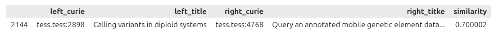

# Abstract

# Introduction

**Overall aim: Enable developers to build systems that support learners to find relevant training materials.**

The distributed and fragmented nature of training materials across research infrastructures, institutions, and within project silos often leads to duplication of materials, wasted resources and storage, the inefficient use of those materials in upskilling personnel, and contributes to the lack of sustainability of the materials themselves. This situation is further exacerbated when considering cross-disciplinary materials, such as those for Research Data Management, which could be used across multiple domains. Several metadata standards are used by training catalogues, including schema.org and schemas.science. 

One way to address these challenges would be to offer a federated solution, connecting across those project/institutional communities, and promoting a cohesive strategy towards FAIR and open training. This would additionally facilitate the identification of Learning Paths or trajectories to enable individuals to leverage content across multiple ‘siloed’ materials, to achieve knowledge goals. It could also offer ‘alternative’ paths across the problem space, which would be exposed, recognised and attributed, thereby identifying the original contributors. Many Learning Paths are linear and sequential, lacking legitimate and viable alternative trajectories.

In this project, we worked in parallel, interrelated streams:

* Interlinked related materials as Learning Paths where appropriate, and explore means to facilitate future automation.   
* Develop a strategy to identify similar or related training materials from distributed resources.  
* Improve the schemas.science profiles concerning ‘Course’ and ‘TrainingMaterial’ to propose how those could be updated to incorporate properties that facilitate exposure in Learning Paths. 

The first day of the project began with a series of short presentations from several of the authors, plus a demonstration of ELIXIR BioHackathon Europe work titled ‘Mining the potential of knowledge graphs for metadata on training’ by Dimitris Panouris and Harshita Gupta of SciLifeLab [@citesForInformation:Panouris2025].

# Training material interoperability

Authors: Petra Steiner, Charles Tapley Hoyt, Oliver Knodel, Martin Voigt, Jacobo Miranda,  

Contributors: Phil Reed, Leyla Jael Castro, 

## Summary of Track B: Express relations between materials

**Description: Interlink related materials as Learning Paths where appropriate, and explore means to facilitate future automation.**

## What we did

There were three pieces of work in this track:

* Curated crosswalks between MoDALIA and Schema.org metadata models for training materials  
* Implemented in the OERbservatory Python package  
* Demonstrated federation in the mTeSS-X platform

mTeSS-X Strategic Planning. Prepared for focus group demonstration of exchanged training materials. Looking ahead to share to the EOSC Catalog.

## Why it is useful, the impact of this work

## Future work

* OSCARS mTeSS-X deliverable: demonstrate exchange of training material between registries.  
* New deployment of DALIA implementing interoperability layer.

# Training material analysis

Authors: Nick Juty, Dilfuza Djamalova, Charles Tapley Hoyt  
Contributors: Phil Reed

## Summary of Track A: Identify similar materials

**Description: Develop a strategy to identify similar or related training materials from distributed resources.**

## What we did

Analog to Swiss-Prot (80s) vs TrEMBL (90s) in UniProt  
Can we automatically pick up related materials from distributed resources and arrange them into a learning path?  
Can we generate learning path suggestions dynamically from registries of materials with sufficient metadata?

Basic prompt, build in comparison of topics, weighting of ‘properties’ using embedded metadata (differing quality/availability).

Table: Prompt input

| Input | Description |
| :---- | :---- |
| List of materials 	 | hard coded or point to a registry (page) |
| Collect similar materials | based on objectives & keywords |
| Create paths / order	 | based on difficulty (often missing) |
| Suggest a title	 | overarching lesson name |

Table: Prompt output. Each path (named) is ordered, reference link, difficulty rating, individual title, licence and provider

| Output | Size |
| :---- | :---- |
| Path 1: Sequencing and QC | 10 items |
| Path 2: Git and Version Control | 6 items |
| Path 3: Genome Annotation | 8 items |

Observations of learning path similarity:

* Detect duplicate materials  
* There were 417 pairs with cosine similarity over 0.9  
* Detect similar materials to support consolidating production efforts  
* Metadata (title, description, objectives, etc) was vectorized using sentence-transformers and pairwise cosine similarity was computed  
  * More than just keywords

{ width=100px }

## Why it is useful, the impact of this work

## Future work

* 

# Organisation into learning paths

Authors: Phil Reed, Alban Gaignard, Leyla Jael Castro  
Contributors: Nick Juty, Roman Baum

## Summary of Track C: Schemas and automation

**Description: Improve the schemas.science profiles concerning ‘Course’ and ‘TrainingMaterial’ to propose how those could be updated to incorporate properties that facilitate exposure in Learning Paths.**

## What we did

Bioschemas aims to improve the Findability on the Web of life sciences resources such as datasets, software, and training materials. It does this by encouraging people in the life sciences to use Schema.org markup in their websites so that they are indexable by search engines and other services. Schemas.science is a collection of domain-agnostic schemas taken from Bioschemas, for concepts such as training materials that are applicable to all domains. There is currently no definition for describing learning pathways of training materials in these schemas, thus limiting the Findability of such resources. 

Work on this track began at the ELIXIR BioHackathon Europe 2025 [@citesForInformation:Panouris2025]. We investigated the requirements for a learning path profile in Bioschemas (and therefore in schemas.science), using two distinct real examples. We described these examples using RDF triples that are valid Schema.org, then described two new Bioschemas profiles. We created a knowledge graph of each learning path example and ran SPARQL queries to confirm that the relationship between the materials was valid, that there was a path that could be traversed. The knowledge graphs could be expressed as RDF and JSON-LD.

Table: Identified two existing learning paths

| Item | Example path 1 | Example path 2 |
| :---- | :---- | :---- |
| Title | [Introduction to Galaxy and Sequence analysis](https://training.galaxyproject.org/training-material/learning-pathways/intro-to-galaxy-and-genomics.html) | [Open Research](https://www.helmholtz-hida.de/en/discover-hida/helmholtz-information-data-science-framework/data-science-course-portfolio/) |
| Provider | Galaxy Training Network | Helmoltz |
| Domain | Life sciences | Domain agnostic |
| Shape | Linear, grouped into modules | Graph, with linear reduction |
| Contents type | Training materials | Courses/Events |

We used the existing type Course, and the existing type Syllabus, to define a new profile LearningPath, which contains one or more LearningPathModule as syllabus sections. Each LearningPathModule contains a list of training materials. The lists are ordered by inheriting from the ListItem profile, providing us with the nextItem property, so each item in a list has a reference to the next. This schema supports linear learning paths, as used by LinkedIn Learning, Coursera, edX and many other providers. A later version of these schemas could be developed to support the full ELIXIR Learning Path with multiple paths, after it is formally published and implemented. 

We can query the learning path knowledge graph using SPARQL, to navigate the path. For example, to identify the prerequisites for a given training material in a path:

SPARQL query on the learning path as a knowledge graph 

Further details are provided [in the GitHub repository](https://github.com/BioSchemas/LearningPath-sandbox/).

We also started to look at how DALIA supports learning paths, and how to easily map between their MoDALIA specification and this proposed Bioschemas. Further details are provided in our [learning paths planning document](https://docs.google.com/document/d/1T7Sm8kiD3GmZYe5H2Cop2Rk--N2lbJ07llLY5nBGKAI/edit?usp=sharing).

## Why it is useful, the impact of this work

TeSS has been unable to automate the ingestion of learning paths because there was no definition in Bioschemas. The publication of such a schema will enable richer ingestion and exchange of materials between catalogues using the TeSS Platform and other platforms. 

The Galaxy Training Network is already using Syllabus in this way to describe their learning paths in metadata, but they do not include any of the materials or the order of modules.

## Future work

* Bioschemas learning path schema reach 0.1-DRAFT. Then include the learning path schema as part of the domain agnostic schemas.science specification.  
* Adoption of learning path schema through ELIXIR (Learning Paths Focus Group, Training Platform) and other providers scraped by TeSS such as Galaxy Training Network.  
* Define the mapping between MoDALIA and Bioschemas for learning paths.

# Connections between tracks 

## Summary of the work that did not fit into one track

## What we did

## Why it is useful, the impact of this work

## Future work

# Conclusion

# GitHub repositories, Jupyter notebooks and data repositories

* OERbservatory  
* [Learning Paths Sandbox (Bioschemas)](https://github.com/BioSchemas/LearningPath-sandbox)

## Acknowledgements

...

## References
